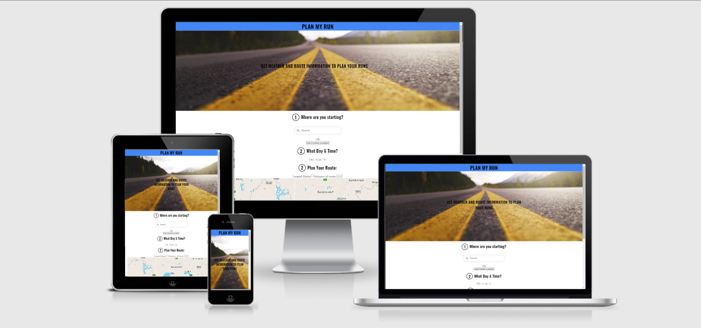

# Plan My Run

[Plan My Run](https://sean-meade.github.io/plan-my-run/) is a website which allows runners to plan a run. It gives them the ability to choose a location, time, day, and then to map out their route with mouse clicks. The running will recieve back weather information for the time and day, and a distance update on each click of the route they are planning.  

The longer the run the more difficult it gets. You have to make sure you plan your route so you run long enough distances to continue to progress. You can run the same shorter distance multiple times to make it up but speaking from experience will drive you crazy. It is important to know how far you must run before going out.



---

## Contents

- [Plan My Run](#plan-my-run)
  - [Contents](#contents)
  - [UX](#ux)
    - [Project Goals](#project-goals)
    - [Site Owner Goals](#site-owner-goals)
    - [Site Visitor/User Goals](#site-visitoruser-goals)
    - [User Stories](#user-stories)
    - [User Requirements and Expectations](#user-requirements-and-expectations)
      - [**Requirements**](#requirements)
      - [**Expectations**](#expectations)
    - [Design Choices](#design-choices)
      - [**Fonts**](#fonts)
      - [**Colours**](#colours)
  - [Wireframes](#wireframes)
    - [**Site Layout**](#site-layout)
  - [Information Architecture](#information-architecture)
  - [Technologies](#technologies)
    - [Languages](#languages)
    - [Libraries & Frameworks](#libraries--frameworks)
    - [Tools](#tools)
  - [Features](#features)
    - [Implemented Features](#implemented-features)
    - [Future Features](#future-features)
  - [Changes applied since planning](#changes-applied-since-planning)
  - [Testing](#testing)
  - [Deployment](#deployment)
    - [Local Deployment](#local-deployment)
    - [Deployment to Github](#deployment-to-)
  - [Credits](#credits)
    - [Images](#images)
    - [Image editing](#image-editing)
    - [Code ideas](#code-ideas)
  - [Acknowledgements](#acknowledgements)

---

## UX

### Project Goals

The main goal of this project is to provide an app that helps runners plan their run. I am achieving this by providing a way for runners to map out potential routes which provides a feedback on distance. Also by adding the ability to get weather information for location, day and time.

### Site Owner Goals

- Provide the users with a helpful web application.
- Take the hassle out of finding a running route with the right distance.
- Provide weather information to inform gear choice.

### Site Visitor/User Goals

- Ability to choose what location to start the run in.
- Ability to choose the day and time for a run and with the location recieve weather information.
- Ability to use the mouse to map out a running route and recieve the distance of the route in return.

### User Stories

**Applies to all site users:**

- As a user, I am able to quickly understand how to navigate the site.
- As a user, I am able to choose what location to start the run in.
- As a user, I am able to change the location when I want.
- As a user, I am able to choose the day and time for a run and with location receive weather information
- As a user, I am able to change the day and time and update the weather information.
- As a user, I am able to use the mouse to map out a running route and receive the distance of the route in return.
- As a user, I am able to undo points of my route and the distance and map updates accordingly.
- As a user, I am able to make my run a looped run (returns back to where I started) and the distance and map updates accordingly.
- As a user, I am able to reset the map at any point and start fresh.
- As a user, I am able to find information or a link to the creator of the site.


**Applies to new site users:**

- As a user, I am able to understand how to use it without instruction.

**Applies to all returning users:**

- As a user, I am able to understand any changes that are made and use the site with no hinderance.

[Back to content](#contents)

### User Requirements and Expectations

#### **Requirements**

- Visually pleasant app design
- Easy site navigation
- Information of the content layed out in a simple and clear way on both mobile and larger screens
- Self-explanatory icons where text is absent

#### **Expectations**

- Quick app load time
- Easy to use "out of the box" with minimal explanation.


[Back to content](#contents)

### Design Choices

#### **Fonts**

- *All fonts*

  ```font-family: "Playfair Display", serif;```

#### **Colours**


[Back to content](#contents)

## Wireframes

### **Site Layout**

Site moc-ups were designed using [figma](figma). The focus was on defining the basic layout structure of the app and identifying how the display would change on different screen sizes such as mobile, tablet and larger screens.

You can view the wireframes created for this project in [site wireframes](/docs) folder here is a list:

- Mobile Wireframe: [Version 1](/docs/wireframes/Plan_My_Run_(Mobile).pdf)
- Laptop Wireframe: [Version 1](/docs/wireframes/Plan_My_Run_(Desktop_Laptop).pdf)

  **Please note, as I was developing the project, I have identified some weaknesses in the UX and therefore made the required changes. The deployed site looks somewhat different in comparison to the wireframes. These changes will allow the user to have a better experience and allow easier navigation. The design theme of the features is a close match to the overall site to ensure continuation and flow. Please check the [Changes applied since planning(#changes-applied-since-planning) section for explanation.*

[Back to content](#contents)

---

## Information Architecture

This is a one page application and as such the information architecture follows most important to least important information according to the intended user. The information is displayed in this order:

1. The title text: this text explains simply what the site does and how it can help the user. This is the most important because it's important for a visitor to understand the purpose of the site on first visit.

2. How to choose the starting point: The user has the choice of choosing the general location and then clicking the start point on the map or using there current location. This is second most important as it is the beginning point for finding a running route.

3. The map: The map along with the text following it is the next most important because it gives the user the information to start building their route with clicks on a map.

4. Functional buttons for the map: After clicking on the map the functional buttons allow more control over building a route. They can loop their route automatically as a lot of runners start and finish their route at the same point (but not all). The undo button allows the user to remove a click and keep the rest of their route intact. The reset route button allows the user to clear everything from the map and start again.

5. The map output: Once the route is made and the user is happy with it they can view the distance of that route and how many waypoints they have left to add to they route if need be.

6. Weather input: The weather is a nice to have when planning a run and so comes close to the end. The user can input the day and time of their run (limited to four days).

7. Weather output: Once the day and time of a run is chosen the user can click Get Weather Info button and receive the relevant weather information in return.

8. Creator information: Lastly if the user is curious as to who created it there is a link to his GitHub account at the bottom of the page in the footer.


[Back to content](#contents)

---  

## Technologies

### Languages

- [HTML](https://developer.mozilla.org/en-US/docs/Web/HTML)
- [CSS](https://developer.mozilla.org/en-US/docs/Web/CSS)
- [JavaScript](https://developer.mozilla.org/en-US/docs/Web/JavaScript)

### Libraries & Frameworks

- [jQuery](https://jquery.com/)
- [Google fonts](https://fonts.google.com/)
- [Font-Awesome](https://fontawesome.com/icons?d=gallery)
- [Turf](https://unpkg.com/browse/@turf/turf@6.3.0/)
- [Bootstrap](https://getbootstrap.com/)

### APIs

- [Weather API](https://www.weatherapi.com/)
- [Mapbox API](https://docs.mapbox.com/api/overview/)

### Tools

- [Git](https://git-scm.com/)
- [GitHub](https://github.com/)
- [Visual Studio Code](https://code.visualstudio.com/)
- [Color editor](https://coolors.co/)
- [Favicons](https://fontawesome.com/)
- [Pixabay](https://pixabay.com/)
- [LunaPic](https://www4.lunapic.com/editor/)
- [Iconfinder](https://www.iconfinder.com/icons/316043/raindrop_icon)

[Back to content](#contents)

---

## Features

### Implemented Features

- The site has **responsive design** when viewed on a mobile, tablet, and desktop.
- **Easy navigation** to external sites, such as social media accounts.
- The user is given feedback when they interact with the website (i.e. login to the website, add new gift, commit to buying a gift etc).

### Functional Features

#### __Loading Screen__
The loading screen allows time for the map to load properly before the user clicks on it. 


#### __Search Location Field__
The search location field allows the user to move the map to the general location of their run.


#### __Start Where I am Button__
This button allows the user to set their current location as the starting point of their route.


#### __Map__
The map allows the user to pan, zoom and angle the current area. By clicking on the route they can set the starting location (if not already set with Start where I am button) seen on the map as a white circle with a blue border. Each subsequent click is marked as a waypoint with a black dot and the route between these points (including the starting point) can be seen by the blue line.


#### __Map Control Buttons__
The map controls allows the user more control over setting their route on the map. The first being a checkbox that allows the user to set the next waypoint at the same location as the starting point (it's possible to have multiple loops in the same route as long as the number of waypoints is 24 or below). Next the Undo button allows the user to remove the last waypoint in the route. Finally the Reset Route button allows the user to completely remove everything relating to the current route build from the map and start over.


#### __Map Output__
The map output shows the the distance of the current route and the number of waypoints left to use (note: the looped waypoint counts as a waypoint). Both update upon each click of map, undo, or reset.


#### __Weather Day & Time Input__
These inputs allow the user to pick the day and time of their run to request the relevant weather information.


#### __Get Weather Button__
This button allows the user to then send the request for the weather information for said day and time.


#### __Weather Information Display__
The weather output then provides the description of the weather in the form of an iamge (hovering over the image will give the description in text), the median, max and min temperature, the chance of rain, the wind speed, and the wind direction.


#### __Link to My Github__
This text provides a link to the Github account of the creator of the site.


### Alert Features for

#### __No Current Location__
An alert telling the user that their current location could not be found when trying to use it for the staring point with the 'Start where I am' button.


#### __No Route Info__
A warning telling the user that the request for the route information isn't working and to contact the creator of the site.


#### __Waypoint Limit Reached__
An alert that tels the user that they have reached the limit of waypoints used on the map.


#### __Choose Time to get Weather__
An alert that asks the user to choose a time in the future when trying to request weather information. This is either the user has chosen a time in the past on the current day or they have not chosen any time or day.


#### __No Starting Point Selected__
An alert that reminds the user to set a starting point where they want the weather information for.


#### __No Weather Information Returned__
An alert that informs the user that the request for the weather information has failed.


[Back to content](#contents)

---

## Changes applied since planning

All changes refer to what is different from the [Wireframes](docs/wireframes) and the [Deployed Site](https://sean-meade.github.io/plan-my-run/)

The blue band across the top of the wire frame with the title 'PLAN MY RUN' was removed because it did not fit in with the open flow of the website. The title text was instead moved the hero image and that was made the header section.

The search button for location was made redundant because clicking on the options in the drop-down list provides the same function.

The first 'Use Current Location' was removed as the same function can be achieved with the second 'Use Current Location' button (now named 'Start where I am') and the undo button. Because of this the 'Start where I am' button has been removed from further down and placed here instead.

The Plan Your Route section has been moved above the weather information due to the Information Architecture. The map has been placed at the top of this section as it is the natural next step after choosing starting location.

The 'Undo' button has been placed beside the 'Looped Route' (now a checkbox for a cleaner look) due to the limitations of the developer. A 'Reset Route' button has been added as user feedback dictated it a very useful feature.

Weather information has two changes. It is now below the Plan Your Route section and the button is now a simple 'Get Weather Info'.

Text has also been provided to inform the user along with alerts for errors.

---

## Testing

## Functional Testing

TC001 

**Description**

Test something.

**Steps**

- Navigate to https://website
- 

**Expected**

This happened

**Actual**

This happened 


<hr>

TC002


## Validator Testing

### CSS

Base Css


### JavaScript

Base JS


### HTML

The following Validated with no errors:
- Home Page
- 


The Following Validator with the same error:
- The something page


[Back to content](#contents)

---

## Deployment

**NAME** project was deployed using the **VS Code IDE**, using **Git** and **GitHub**.

Before deploying the application, install the following:

- Git

### Local Deployment

To deploy Art-ial locally, take the following steps:

1. From the applications [repository](link-to-repo), click the *code* button and download the zip file.

    Alternatively, you can clone the repository using the following line in your terminal:

```terminal
git clone link-to-repo
```

2. Access the folder in your terminal window 

[Back to content](#contents)

### Deployment to 

[Back to content](#contents)

---

## Credits

### Images

* 
* Rain drop icon from weather is from [Iconfinder](https://www.iconfinder.com/)

### Image editing

* All image editing was done with [LunaPic](https://www4.lunapic.com/editor/)
* Darkened the hero image with [Pinetools](https://pinetools.com/darken-image)

### Code ideas

* Loading screen adapted from Section 6 of the [50 Projects In 50 Days](https://www.udemy.com/course/50-projects-50-days/) course on Udemy.com by Brad Traversy 

[Back to content](#contents)

---

## Acknowledgements

Site creators:

[Sean Meade](https://github.com/sean-meade)

[Back to content](#contents)

